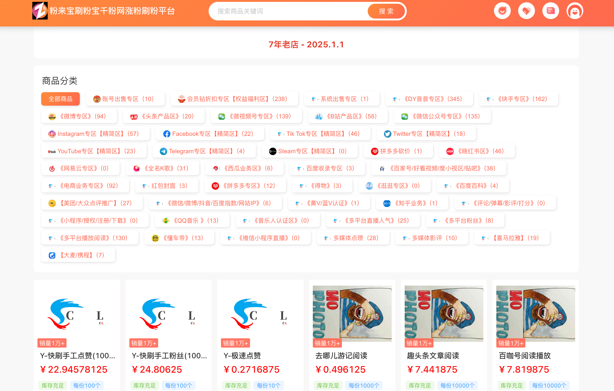

# 粉来宝，刷粉宝，刷粉平台介绍

刷粉平台是一类提供 **社交账号粉丝数量提升服务** 的第三方工具或服务平台，主要面向想要在短时间内提升社交账号影响力的个人或商家。  
它通过技术手段或推广资源，帮助用户快速增加账号的关注者数量、互动量（点赞、评论、分享）等。  

平台地址：www.shuafenbao.top

---

## 🔑 主要功能

- **粉丝增长服务**：支持微博、抖音、快手、微信公众号、B站、小红书等平台的粉丝数量提升。  
- **互动量提升**：提供视频/图文的点赞、评论、转发服务，用于增强账号活跃度。  
- **多账号管理**：支持同时管理多个社交账号，批量操作粉丝增长。  
- **定向推广**：可选择指定的地区、标签或兴趣群体进行定向刷粉。  
- **数据统计**：实时监控粉丝增长数据、互动量，生成分析报表。  

---

## 📊 适用人群  
- **自媒体运营者**：希望快速提高账号的粉丝基础，打造影响力。  
- **品牌商家**：用于营销推广，提升品牌曝光度。  
- **电商卖家**：通过账号“粉丝背书”提高店铺信誉度。  

---
---

## ✅ 正规替代方式

相比刷粉，以下更长期有效的方式更推荐：  
- **内容营销**：发布高质量原创内容，提升自然关注度。  
- **广告投放**：利用平台官方广告投放工具提升曝光率。  
- **联合推广**：与相关领域的达人/博主合作，实现精准引流。  
